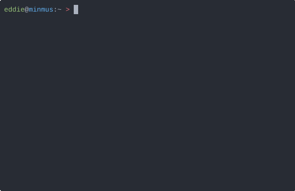

*rb-scrobbler* is a program written in Go that parses a log of listened tracks generated by an MP3 player
running [rockbox](https://rockbox.org) custom firmware and submits them to the music tracking website [last.fm](https://last.fm).

More information, code and downloads available at [GitHub](https://github.com/jeselnik/rb-scrobbler)

Licensed under GPL3
